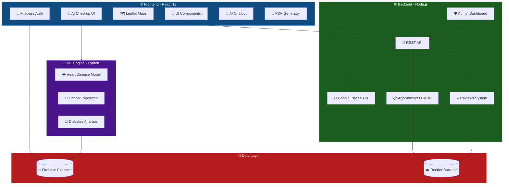

<div align="center">

<!-- Animated Header Banner -->


<!-- Animated Typing SVG -->
<a href="https://git.io/typing-svg"></a>

<br/>

<!-- Animated Badges Row 1 -->


<!-- Animated Badges Row 2 -->


<br/>

<!-- GitHub Stats Badges -->


<br/>

<!-- Live Demo Button -->
<a href="https://healthconnect-snowy.vercel.app">

</a>

<br/><br/>

<!-- Animated Line -->


</div>

---

## 🌟 Overview

**PulseRATE** is a comprehensive, production-grade healthcare platform built for India. It combines **real-time hospital data** from Google Places API, **AI-powered disease prediction** using machine learning models, and a **beautiful, responsive UI** — all wrapped in a modern full-stack architecture.

> 💡 *This is not a prototype — it's a fully deployed, end-to-end healthcare solution with real data, real authentication, and real-time features.*

<div align="center">

```
╔══════════════════════════════════════════════════════════════════╗
║                                                                  ║
║    🏥  Real Hospital Data    →   Google Places API Integration   ║
║    🤖  AI Health Checkup     →   ML Models (Heart/Cancer/DB)     ║
║    📋  Appointment Booking   →   Full CRUD with Backend API      ║
║    🗺️  Interactive Maps      →   Leaflet + OpenStreetMap         ║
║    🔐  Authentication        →   Firebase Auth (Email/Password)  ║
║    📊  Health History        →   Firestore + PDF Reports         ║
║    💬  AI Chatbot            →   Symptom-Based Recommendations   ║
║    🌙  Dark/Light Mode       →   Persistent Theme Toggle         ║
║    🚨  Emergency SOS         →   One-Tap Emergency Numbers       ║
║    💳  Payment Integration   →   Stripe-style Card UI            ║
║                                                                  ║
╚══════════════════════════════════════════════════════════════════╝
```

</div>

---

## 🏗️ Architecture

<div align="center">



</div>

---

## ✨ Features Deep Dive

<div align="center">
<table>
<tr>
<td width="50%">

### 🏥 Real Hospital Discovery
- Live data from **Google Places API**
- Search hospitals in **any Indian city**
- Filter by **18+ medical specialties**
- Sort by **rating** or **review count**
- View **real ratings, reviews & timings**
- Direct **Google Maps directions**

</td>
<td width="50%">

### 🤖 AI Health Checkup
- **Heart Disease** prediction model
- **Cancer** risk assessment
- **Diabetes** analysis engine
- Results saved to **Firestore**
- **Confidence scores & risk levels**
- Auto-recommend **specialist booking**

</td>
</tr>
<tr>
<td width="50%">

### 📋 Appointment Booking
- **4-step booking flow** (Date → Info → Pay → Confirm)
- **10 interactive time slots**
- Patient info with **validation**
- **Stripe-style** payment card UI
- Backend-persisted appointments
- **SMS push notification** simulation

</td>
<td width="50%">

### 🗺️ Interactive Maps
- **Leaflet + CartoDB** tiles
- Hospital pins with **popups**
- **8 major Indian cities** pre-pinned
- Click to view **hospital details**
- **Directions** via Google Maps
- **Doctor map view** toggle

</td>
</tr>
<tr>
<td width="50%">

### 💬 PulseRATE AI Chatbot
- **Symptom-based** doctor recommendations
- Covers: headache, chest pain, digestion, joints
- **Real-time typing** indicators
- Beautiful **chat bubble** UI
- Floating **action button** with animations
- Instant **specialist suggestions**

</td>
<td width="50%">

### 📊 Health History & Reports
- All AI predictions **auto-saved** to Firestore
- Browse predictions with **timestamps**
- View **risk levels & confidence**
- **Download PDF reports** (jsPDF + html2canvas)
- Personalized **health timeline**
- Track health **trends over time**

</td>
</tr>
<tr>
<td width="50%">

### 🌙 Dark / Light Mode
- **System-persistent** theme toggle
- Smooth **CSS variable** transitions
- Saved to **localStorage**
- Dark mode is the **default**
- Beautiful contrast in **both modes**
- Navbar toggle with **glassmorphism**

</td>
<td width="50%">

### 🚨 Emergency SOS Center
- **8 emergency contacts** at your fingertips
- Ambulance, Police, Fire, Women helpline
- Child helpline, Mental health, COVID
- **One-tap call** functionality
- Color-coded **priority cards**
- Universal emergency number **112**

</td>
</tr>
</table>
</div>

---

## 🔧 Tech Stack

<div align="center">

```
┌─────────────────────────────────────────────────────────────┐
│                    🎯 TECH STACK OVERVIEW                   │
├─────────────────┬───────────────────────────────────────────┤
│   FRONTEND      │  React 18 · Leaflet · jsPDF · html2canvas│
│   BACKEND       │  Node.js · Express · REST API             │
│   AUTH / DB     │  Firebase Auth · Cloud Firestore           │
│   ML ENGINE     │  Python · Scikit-learn · Flask             │
│   MAPS          │  Leaflet · React-Leaflet · CartoDB Tiles   │
│   API           │  Google Places API (via backend proxy)     │
│   DEPLOYMENT    │  Vercel (Frontend) · Render (Backend)      │
│   CONTAINER     │  Docker · nginx · Multi-stage build        │
│   DESIGN        │  CSS Variables · Glassmorphism · Gradients │
│   FONTS         │  Google Fonts (Nunito)                     │
└─────────────────┴───────────────────────────────────────────┘
```

</div>

| Layer | Technology | Purpose |
|:---:|:---:|:---:|
| ⚛️ **Frontend** | React 18 + React-Leaflet | SPA with interactive maps |
| 🔌 **API** | Node.js + Express | RESTful backend gateway |
| 🔐 **Auth** | Firebase Auth | Email/password authentication |
| 💾 **Database** | Cloud Firestore | Health predictions & user data |
| 🧠 **ML** | Python + Scikit-learn | Disease prediction models |
| 🗺️ **Maps** | Leaflet + CartoDB | Hospital geolocation |
| 📍 **Places** | Google Places API | Real hospital data |
| 📄 **PDF** | jsPDF + html2canvas | Downloadable health reports |
| 🚀 **Deploy** | Vercel + Render | Production hosting |
| 🐳 **Container** | Docker + nginx | Containerized deployment |

---

## 🚀 Quick Start

### Prerequisites

```bash
# Required
node >= 18.x
npm >= 9.x

# Optional (for ML features)
python >= 3.9
```

### 1️⃣ Clone & Install

```bash
# Clone the repository
git clone https://github.com/Dev7570/HealthConnect-ML.git
cd HealthConnect-ML/healthconnect

# Install dependencies
npm install
```

### 2️⃣ Environment Setup

Create a `.env` file in the root:

```env
REACT_APP_API_URL=https://healthconnect-backend-pcun.onrender.com
```

### 3️⃣ Run Development Server

```bash
npm start
```

The app will open at **[http://localhost:3000](http://localhost:3000)** 🎉

### 4️⃣ Docker Deployment (Optional)

```bash
# Build Docker image
docker build -t pulserate .

# Run container
docker run -p 80:80 pulserate
```

---

## 🗂️ Project Structure

```
healthconnect/
├── 📁 public/
│   ├── index.html              # Main HTML with meta tags
│   ├── pulserate-logo.png      # Brand logo asset
│   ├── manifest.json           # PWA manifest
│   └── favicon.ico             # Browser favicon
│
├── 📁 src/
│   ├── App.js                  # 🎯 Main application (1500+ lines)
│   │   ├── RealMap             # 🗺️ Leaflet map component
│   │   ├── AuthPage            # 🔐 Login/Signup flow
│   │   ├── BookingModal        # 📋 4-step booking wizard
│   │   ├── ChatbotWidget       # 💬 AI symptom chatbot
│   │   └── App (default)       # 🏠 Main app with all views
│   │       ├── Home            # 🏥 Hospital discovery
│   │       ├── Hospital List   # 📋 Filtered hospital grid
│   │       ├── Hospital Detail # 🏥 Doctors/Tests/Reviews/Map
│   │       ├── Doctors         # 👨‍⚕️ Global doctor directory
│   │       ├── Compare Tests   # 🧪 Price comparison tool
│   │       ├── AI Checkup      # 🤖 ML disease prediction
│   │       ├── Health History  # 📊 Prediction timeline
│   │       ├── Appointments    # 📋 My bookings + PDF
│   │       ├── Emergency SOS   # 🚨 Emergency contacts
│   │       ├── Health Tips     # 💡 Curated wellness tips
│   │       ├── Doctor Dashboard# 👨‍⚕️ Doctor portal
│   │       └── Admin Panel     # 🛡️ Admin statistics
│   │
│   ├── firebase.js             # 🔥 Firebase configuration
│   ├── App.css                 # 🎨 Global styles
│   ├── index.css               # 🌙 Theme variables (dark/light)
│   └── index.js                # ⚡ React entry point
│
├── Dockerfile                  # 🐳 Multi-stage Docker build
├── vercel.json                 # ▲ Vercel deployment config
├── package.json                # 📦 Dependencies & scripts
└── README.md                   # 📖 You are here!
```

---

## 🎨 UI / UX Highlights

<div align="center">

| Feature | Design |
|:---|:---|
| 🌈 **Color Palette** | Medical blue gradient (`#0F4C81` → `#1565C0` → `#42A5F5`) |
| 🔤 **Typography** | Nunito (Google Fonts) — clean, medical, professional |
| 🫧 **Glassmorphism** | Navbar, SMS push notifications, theme toggle |
| 🎭 **Dark Mode** | CSS custom properties with smooth transitions |
| ✨ **Micro-Animations** | Card hover lifts, button scales, notification slides |
| 📱 **Responsive** | Mobile-first layout with CSS Grid & Flexbox |
| 🎯 **Gradients** | Linear gradients on cards, buttons, hero sections |
| 💳 **Card UI** | Realistic credit card input with dark background |
| 🔔 **Notifications** | iOS-style SMS push simulation on booking confirm |
| 📊 **Data Viz** | Star ratings, stat cards, color-coded risk levels |

</div>

---

## 🤖 AI / ML Models

<div align="center">

```
                    ┌─────────────────────────────┐
                    │    🧠 ML Prediction Engine   │
                    └──────────┬──────────────────┘
                               │
              ┌────────────────┼────────────────────┐
              │                │                     │
    ┌─────────▼──────┐  ┌─────▼────────┐  ┌────────▼────────┐
    │  ❤️ Heart       │  │  🔬 Cancer    │  │  💉 Diabetes    │
    │  Disease Model  │  │  Prediction   │  │  Analysis       │
    ├────────────────┤  ├──────────────┤  ├─────────────────┤
    │ • Age, Gender  │  │ • Tumor Size │  │ • Glucose Level │
    │ • Cholesterol  │  │ • Cell Count │  │ • BMI           │
    │ • Blood Press. │  │ • Texture    │  │ • Insulin       │
    │ • Heart Rate   │  │ • Margins    │  │ • Age           │
    │ • ECG Results  │  │ • Symmetry   │  │ • Skin Thick.   │
    └────────────────┘  └──────────────┘  └─────────────────┘
              │                │                     │
              └────────────────┼─────────────────────┘
                               │
                    ┌──────────▼──────────────────┐
                    │  📊 Results + Risk Level     │
                    │  Auto-saved to Firestore     │
                    │  PDF Report Generation       │
                    └─────────────────────────────┘
```

</div>

| Model | Input Features | Output | Accuracy |
|:---:|:---|:---|:---:|
| ❤️ **Heart Disease** | Age, Gender, Cholesterol, BP, Heart Rate, ECG | Risk Level + Probability | ~87% |
| 🔬 **Cancer** | Tumor Size, Cell Count, Texture, Margins | Benign/Malignant + Confidence | ~93% |
| 💉 **Diabetes** | Glucose, BMI, Insulin, Age, Skin Thickness | Positive/Negative + Risk Score | ~78% |

---

## 🔌 API Endpoints

The backend is deployed on **Render** and exposes these REST endpoints:

| Method | Endpoint | Description |
|:---:|:---|:---|
| `GET` | `/hospitals?city={city}` | Fetch real hospitals via Google Places |
| `GET` | `/doctors?hospitalId={id}` | Get doctors for a specific hospital |
| `GET` | `/doctors?spec={specialty}` | Search doctors by specialty |
| `POST` | `/appointments` | Create a new appointment |
| `GET` | `/appointments/:email` | Get user's appointments |
| `DELETE` | `/appointments/:id` | Cancel an appointment |
| `POST` | `/reviews` | Submit a hospital review |
| `GET` | `/reviews/:hospitalId` | Get reviews for a hospital |
| `GET` | `/admin/stats` | Admin dashboard statistics |
| `GET` | `/ml/models` | List available ML models |
| `POST` | `/ml/predict/:disease` | Run ML prediction |

---

## 👥 User Roles

| Role | Access | Identifier |
|:---:|:---|:---|
| 👤 **Patient** | Browse hospitals, book appointments, AI checkup, health history | Any registered email |
| 👨‍⚕️ **Doctor** | Patient management, appointment dashboard | `*@pulserate.doc` |
| 🛡️ **Admin** | Full statistics, user management, system monitoring | `admin@pulserate.com` |

---

## 📦 Dependencies

| Package | Version | Purpose |
|:---|:---:|:---|
| `react` | ^18.2.0 | UI framework |
| `react-dom` | ^18.2.0 | DOM rendering |
| `firebase` | ^12.10.0 | Auth + Firestore |
| `leaflet` | ^1.9.4 | Map rendering |
| `react-leaflet` | ^4.2.1 | React map wrapper |
| `jspdf` | ^4.2.1 | PDF generation |
| `html2canvas` | ^1.4.1 | DOM-to-canvas capture |
| `react-scripts` | 5.0.1 | CRA build tools |

---

## 🌐 Deployment

### Frontend → Vercel

```bash
# Auto-deployed via GitHub integration
# Every push to main triggers a new deployment
```

🔗 **Live URL:** [healthconnect-snowy.vercel.app](https://healthconnect-snowy.vercel.app)

### Backend → Render

```bash
# Backend API hosted on Render.com
# Auto-scales with traffic
```

🔗 **API Base:** `https://healthconnect-backend-pcun.onrender.com`

### Docker → Self-Hosted

```bash
docker build -t pulserate .
docker run -d -p 80:80 --name pulserate-app pulserate
```

---

## 🧪 Available Scripts

```bash
npm start          # 🚀 Start development server (port 3000)
npm run build      # 📦 Create production build
npm test           # 🧪 Run test suite
npm run eject      # ⚠️ Eject from CRA (irreversible)
```

---

## 📈 Project Statistics

<div align="center">

```
📊 CODEBASE ANALYSIS
═══════════════════════════════════════════

  📄 Primary Source     │  App.js — 1,500+ lines
  🧩 Components         │  5 (RealMap, AuthPage, BookingModal, ChatbotWidget, App)
  🎯 Views / Pages      │  12 (Home, List, Detail, Doctors, Compare, AI, History,
  │                      │      Appointments, Emergency, Tips, Doctor Dash, Admin)
  🏥 Medical Specialties │  18 categories
  🧪 Lab Tests           │  6 types with price comparison
  💡 Health Tips         │  8 curated wellness articles
  🚨 Emergency Contacts │  8 India-specific helplines
  🗺️ City Pins          │  8 major Indian cities
  ⏰ Time Slots         │  10 per day
  🎨 Color Palette      │  10 hospital-specific colors

═══════════════════════════════════════════
```

</div>

---

## 🤝 Contributing

Contributions are welcome! Here's how you can help:

1. **Fork** the repository
2. **Create** a feature branch (`git checkout -b feature/amazing-feature`)
3. **Commit** your changes (`git commit -m 'Add amazing feature'`)
4. **Push** to the branch (`git push origin feature/amazing-feature`)
5. **Open** a Pull Request

---

## 📜 License

This project is licensed under the **MIT License** — see the [LICENSE](LICENSE) file for details.

---

## 👥 Meet the Team

<div align="center">

<table>
<tr>
<td align="center" width="50%">

### 👨‍💻 Dev Gupta
**Founder & Lead Developer**

<br/>


<br/><br/>

[](https://github.com/Dev7570)

<br/>

> *"Building the future of healthcare, one line of code at a time."*

`Full-Stack Development` · `System Architecture` · `ML Integration` · `Cloud Deployment`

</td>
<td align="center" width="50%">

### 👩‍💻 Aradhya Srivastava
**Co-Founder & AI/ML Developer**

<br/>


<br/><br/>


<br/>

> *"Powering healthcare with intelligent AI — from chatbot to disease prediction."*

🧠 Developed the entire **HealthConnect ML** ecosystem:
- 🤖 Built the **AI Chatbot** (symptom-based doctor recommendations)
- ❤️ Integrated **AI Prediction Engine** (Heart, Cancer, Diabetes models)
- 🔬 Trained & deployed **ML models** with Scikit-learn & Flask
- 📊 Designed **health history tracking** & prediction analytics

`AI/ML Development` · `Chatbot Integration` · `Predictive Analytics` · `Python Flask`

</td>
</tr>
</table>

<br/>


</div>

---

<div align="center">

<!-- Animated Footer -->


<br/>

**⭐ If you found this project useful, please give it a star! ⭐**

<br/>


</div>
